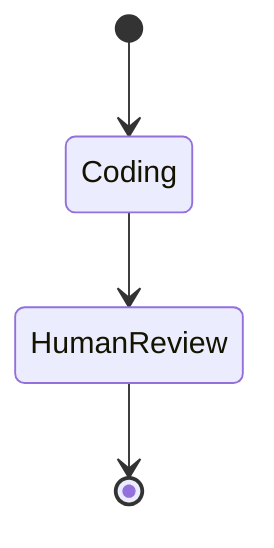
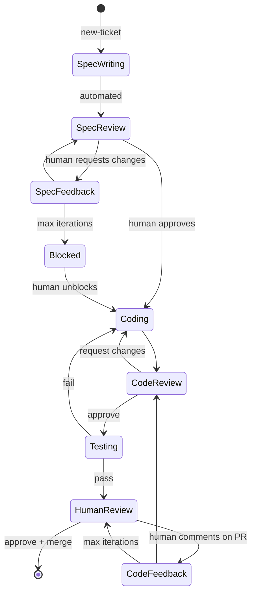
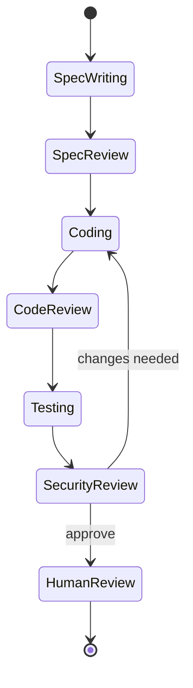
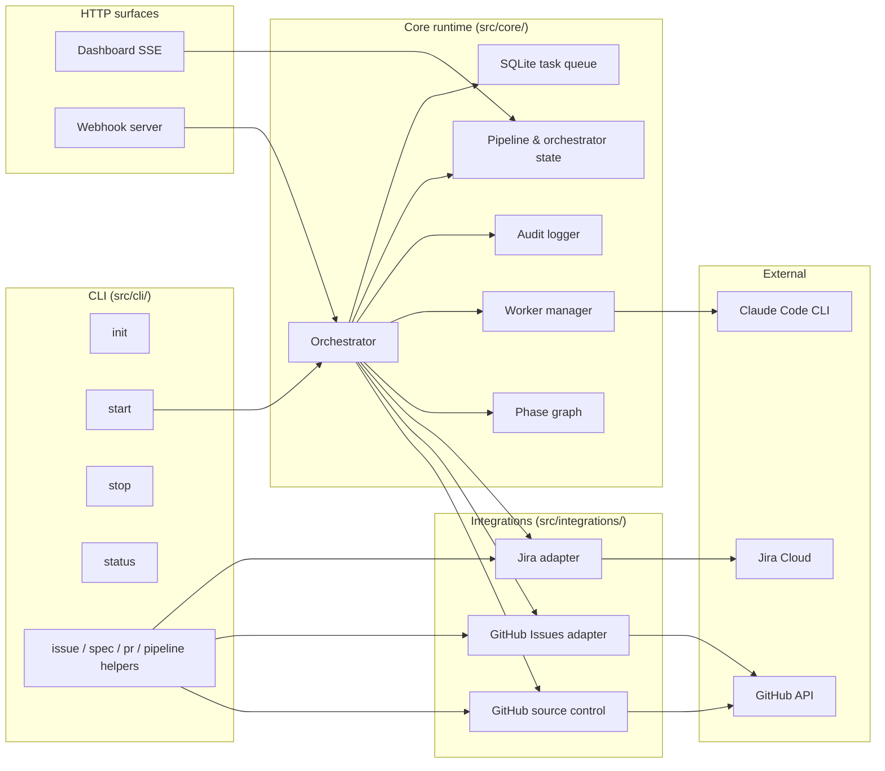

# Red Queen

<p align="center"></p>

> Named for the AI that ran The Hive. Yours runs your SDLC.

[](https://github.com/odyth/red-queen/actions/workflows/ci.yml)
[](https://opensource.org/licenses/MIT)
[](#preview-release)

**The Red Queen doesn't think. It commands.**

Deterministic **AI agent orchestrator** for **autonomous coding** — zero tokens on routing, full SDLC pipeline, first-class **human-in-the-loop AI** gates.

## TL;DR

You file a ticket. Red Queen has Claude write a spec for it. You approve. Claude
writes the code and opens a PR. Another Claude reviews it. Another tests it.
You review the final PR and merge. You can jump in at any gate with feedback,
or rip the gates out entirely.

It's a tiny AI dev team. You're the tech lead. The orchestrator is deterministic
— no LLM deciding what to do next, no wasted tokens on routing.

<!-- TODO-MEDIA: dashboard screenshot | path: ./assets/dashboard.png | size: 1400px wide -->

## Preview release

> **v0.1.0 is a preview release.** The API surface is stable enough to build
> on, but expect rough edges. Please file bugs at
> [github.com/odyth/red-queen/issues](https://github.com/odyth/red-queen/issues).

## What Is Red Queen?

Red Queen is a state machine that orchestrates AI coding agents through a complete software development lifecycle. It dispatches isolated AI workers to write specs, implement code, review PRs, run tests, and address feedback — all without spending a single AI token on orchestration.

The orchestrator is ~600 lines of deterministic logic. No black box. No AI deciding what to do next. Just a state machine that commands workers and enforces human checkpoints. This is **SDLC automation** with a **deterministic AI orchestrator** at its heart, not another agentic black box.

## Key Features

- **Zero-token orchestration** — The state machine is pure logic. Cheaper, faster, and fully debuggable compared to AI-driven orchestrators.
- **Isolated skill workers** — Each phase (spec writing, coding, review, testing, feedback) runs a purpose-built prompt in isolation. Focused prompts outperform kitchen-sink mega-agents.
- **Human-in-the-loop gates** — Human review checkpoints are first-class workflow, not an afterthought. You stay in control.
- **Issue tracker integration** — Bidirectional sync with Jira and GitHub Issues. Work flows from your issue tracker through the pipeline and back.
- **Retry with escalation** — Failed phases retry up to 3 times, then escalate to a human. No infinite loops.
- **Webhook + polling** — Optional webhook server for instant response, with polling fallback that works out of the box.

## For AI agents

Working from this repo in Cursor / Claude Code / Copilot / Windsurf? Start with
[AGENTS.md](AGENTS.md) — it has the build commands, code style, architecture
principles, and the interface contracts for adding integrations.

Installing this into a user's project? One-liner to hand to your agent:

> "Install redqueen, run `redqueen init -y` with github-issues + github,
> add my GITHUB_PAT to .env, start it."

LLM crawler index: [llms.txt](llms.txt).

## Your pipeline, your rules

Phases are dynamic — defined in `redqueen.yaml`, not baked into the code.
Skills are user-overridable markdown prompts. Human gates can be added,
removed, or reordered to match how your team actually ships. This is an
**agentic workflow** you configure, not a black-box **multi-agent coding**
pipeline you have to accept.

### Minimal — ship fast, minimum ceremony



<details><summary>YAML</summary>

```yaml
pipeline:
  baseBranch: origin/main
  phases:
    - name: coding
      type: automated
      skill: coder
      next: human-review
      assignTo: ai
    - name: human-review
      type: human-gate
      next: done
      assignTo: human
```

</details>

### Default — full pipeline, maximum safety



<details><summary>YAML</summary>

```yaml
pipeline:
  baseBranch: origin/main
  # phases omitted — defaults from src/core/defaults.ts apply:
  # spec-writing → spec-review → coding → code-review → testing → human-review
  # + spec-feedback, code-feedback, blocked rework / escalation loops
```

</details>

### Custom — add your own gates



<details><summary>YAML</summary>

```yaml
pipeline:
  baseBranch: origin/main
  phases:
    # ...default phases up through testing...
    - name: testing
      type: automated
      skill: tester
      next: security-review
      onFail: coding
      assignTo: ai
    - name: security-review
      type: human-gate
      next: human-review
      rework: coding
      assignTo: human
    - name: human-review
      type: human-gate
      next: done
      assignTo: human
```

</details>

### Skills you can override

| Skill | Purpose |
|---|---|
| `prompt-writer` | Writes specs (fresh + revision flows) |
| `coder` | Implements the spec, opens a PR |
| `reviewer` | Reviews the PR against the spec and coding standards |
| `tester` | Verifies build + tests locally and in CI |
| `comment-handler` | Addresses PR review feedback iteratively |

Drop `SKILL.md` into `.redqueen/skills/<name>/` and it wins over the built-in.
Full context contract in [src/skills/README.md](src/skills/README.md).

## Quickstart

Get Red Queen running on your own GitHub repo in ~15 minutes using a
Personal Access Token. This path has no Jira dependency and no App
registration.

### 0. Install and authenticate Claude Code

Red Queen is a **Claude Code orchestrator** — it dispatches Claude Code
workers, so the CLI must be installed and logged in first. Follow
[Anthropic's Claude Code install docs](https://docs.anthropic.com/en/docs/claude-code/overview)
and confirm `claude --version` works in your shell.

### 1. Install

```bash
npm install -g redqueen
# or run each command with `npx redqueen ...`
```

### 2. Generate a GitHub PAT

Go to <https://github.com/settings/personal-access-tokens/new>. Create a
fine-grained token scoped to your target repo with:

- **Repository access**: only the target repo
- **Permissions**: Contents (read/write), Issues (read/write), Pull
  requests (read/write), Workflows (read/write), Metadata (read)

Copy the token.

### 3. Initialize

Inside your git repo:

```bash
redqueen init -y
# Answer prompts for issue tracker type (github-issues) and source control (github).
# `-y` accepts everything else; edit redqueen.yaml afterward if needed.
```

### 4. Add your token

Edit `.env` (created by init, already gitignored):

```
GITHUB_PAT=ghp_xxxxxxxxxxxxxxxxxxxx
```

### 5. Start

```bash
redqueen start
```

Open <http://127.0.0.1:4400> — the dashboard.

<!-- TODO-MEDIA: dashboard after 'redqueen start' | path: ./assets/dashboard-running.png | size: 1400px wide -->

### 6. Create a test issue

In your GitHub repo, open a new issue describing a small change. Add the
`rq:phase:spec-writing` label — this is what the polling reconciler
looks for (it iterates automated phases and enqueues work for any issue
carrying the matching `rq:phase:*` label). Red Queen creates the label
automatically on first use if it doesn't exist yet, but you need to add
it to the issue yourself.

The orchestrator polls every 30 seconds; you'll see the label move
through `rq:phase:spec-writing` → `rq:phase:spec-review` →
`rq:phase:coding` etc. as phases complete. Red Queen adds `rq:active`
on its own while it's working — don't add that one manually.

<!-- TODO-MEDIA: asciinema cast or GIF of a ticket moving through phases | path: ./assets/demo.gif -->
<!-- TODO-MEDIA asciinema script: rec --title="redqueen first run" --command="bash scripts/demo.sh" -->

### 7. Learn more

That's the loop. See the [GitHub Issues adapter
README](https://github.com/odyth/red-queen/blob/master/src/integrations/github-issues/README.md)
for full label conventions, webhook setup (which enables the
`new-ticket` on-assign flow), and troubleshooting.

## Upgrading

When a new `redqueen` version ships and you're running as a daemon:

```bash
npm install -g redqueen@latest
redqueen service restart
```

The installed launchd/systemd service just execs an absolute path into
the global npm install, so `npm install -g` overwrites the on-disk code
and `service restart` re-execs it. No uninstall needed.

Run `redqueen service install` *before* the restart if:

- the release notes call out changes to the wrapper script, plist, or
  systemd unit;
- you've switched Node versions since the original install (the wrapper
  has the node binary path baked in);
- a new release adds auto-detection you want to adopt (e.g.
  `claudeBin`).

`service install` is idempotent — it rewrites the wrapper and reloads
the service definition, then a `service restart` picks it up.

If you're running `redqueen start` in the foreground instead, just
`Ctrl+C` and relaunch after `npm install -g`.

## Troubleshooting

| Symptom | Likely cause | Fix |
|---|---|---|
| `command not found: redqueen` | Global install failed or not on PATH | Re-run `npm install -g redqueen`, verify `which redqueen` |
| `command not found: claude` | Claude Code CLI not installed | Install from [Anthropic's docs](https://docs.anthropic.com/en/docs/claude-code/overview); `claude` must be on PATH |
| Polling finds nothing / label doesn't move | Label `rq:phase:spec-writing` not added to issue | Add the label manually on the issue; Red Queen creates the label but doesn't tag existing issues |
| `401 Unauthorized` from GitHub | PAT missing a scope (Contents / Issues / Pull requests / Workflows / Metadata) | Regenerate fine-grained PAT with full scope list from Quickstart step 2 |
| `403` / secondary rate limit | PAT hitting GitHub rate limits on polling repo | Enable webhooks (adapter README) or increase poll interval |
| Webhook signatures failing | `GITHUB_WEBHOOK_SECRET` mismatch between GitHub and `.env` | Set the same secret in both locations, restart `redqueen start` |
| Worker stalls mid-phase | Claude Code prompt hit an unexpected state | Check `.redqueen/audit/` logs; phase retries up to 3 then escalates to `blocked` |
| Jira phase not moving | `phaseMapping` option IDs don't match Jira dropdown | Pull fresh option IDs from Jira, update `redqueen.yaml` |

Per-adapter issues live in each adapter's README.

## Full Setup

- **Jira + GitHub source control** — see
  [Jira adapter README](https://github.com/odyth/red-queen/blob/master/src/integrations/jira/README.md)
  and
  [GitHub source control README](https://github.com/odyth/red-queen/blob/master/src/integrations/github/README.md).
- **GitHub Issues + GitHub source control** (easiest) — see the
  [GitHub Issues adapter README](https://github.com/odyth/red-queen/blob/master/src/integrations/github-issues/README.md).
- **Webhooks** — see each adapter's README for setup. Polling works
  out of the box; webhooks are a latency optimization.

## Example Configs

Two complete, copy-pasteable configurations live in
[`examples/`](https://github.com/odyth/red-queen/tree/master/examples):

- [`examples/github-issues/`](https://github.com/odyth/red-queen/tree/master/examples/github-issues) —
  GitHub Issues + GitHub source control with a PAT. The simplest possible setup.
- [`examples/jira-github/`](https://github.com/odyth/red-queen/tree/master/examples/jira-github) —
  Jira issue tracker + GitHub source control with a BYO GitHub App.
  Mirrors the prototype this project was extracted from.

## Architecture



```
src/
├── cli/               # CLI commands (init, start, stop, status, helpers)
├── core/              # State machine, queue, config, orchestrator
├── dashboard/         # Embedded dashboard + SSE events
├── integrations/      # Issue tracker & source control adapters
│   ├── jira/          # Jira adapter
│   ├── github/        # GitHub source control
│   └── github-issues/ # GitHub Issues as an issue tracker
├── skills/            # Default skill templates (user-overridable)
├── templates/         # Scaffolding templates used by `redqueen init`
└── webhook/           # Optional webhook server (shares dashboard port)
```

Red Queen uses an adapter pattern for integrations. All issue trackers implement a common `IssueTracker` interface, making it straightforward to add support for Linear, Shortcut, or any other tracker.

## How Is This Different?

Most AI coding tools use AI to orchestrate AI — spending tokens to decide what to do next. Red Queen takes the opposite approach: a **deterministic AI orchestrator** that keeps humans in the loop and doesn't gamble on an LLM to route work.

| | Red Queen | Claude Code (solo) | Aider | Cline / Roo | Devin / OpenHands |
|---|---|---|---|---|---|
| Form factor | Background orchestrator | Interactive CLI | Interactive pair | IDE agent | Autonomous agent |
| Orchestration | Deterministic state machine | You are the orchestrator | You are the orchestrator | IDE-driven loop | LLM-driven loop |
| Human gates | First-class, configurable | Ad-hoc | Ad-hoc | Ad-hoc | Minimal |
| Token cost for routing | Zero | N/A (you route) | N/A (you route) | Per decision | Per decision |
| Works while you sleep | Yes | No | No | No | Yes |
| Debuggable flow | Read the state machine | N/A | N/A | Hope the LLM explains | Hope the LLM explains |

Red Queen isn't a replacement for the tools in the other columns — it's the
manager that delegates to them. It runs Claude Code workers today; the adapter
pattern means swapping in other coding agents is a config change, not a
rewrite.

## Integrations

| Integration | Status |
|---|---|
| Jira | Supported |
| GitHub Issues | Supported |
| GitHub (source control) | Supported |
| Linear | Planned |

## FAQ

**Do I need Claude Code?** Yes today. Other CLIs are planned; the adapter
pattern makes adding them straightforward.

**Does it work with Cursor / Copilot / Windsurf?** Red Queen dispatches
Claude Code workers headlessly; it's orthogonal to whatever IDE assistant
you use while coding yourself.

**How much does it cost to run?** The orchestration itself is free and
spends zero tokens. Tokens are what your Claude subscription or API
already charges for the actual code work.

**Can I self-host?** Yes. It runs on your laptop or any Node 24+ box.
No hosted service is required.

**Does it work with monorepos?** Yes — `project.buildCommand` and
`testCommand` scope per-run; per-module commands are configurable.

**Is my code sent anywhere?** Only to the AI CLI you configure. Red Queen
itself is a local process talking to GitHub / Jira over HTTPS.

**What happens if Claude gets stuck?** Phases retry up to 3 times and
then escalate to a human gate. No infinite loops.

**Can I remove the human gates?** Yes — edit `redqueen.yaml`. Gates are
config, not hardcoded.

**Can I add my own skills?** Yes — drop `SKILL.md` at
`.redqueen/skills/<name>/`. See the [skills README](src/skills/README.md).

**Will it work with Linear / Bitbucket?** Not yet. Jira and GitHub ship
today; the adapter pattern makes new trackers straightforward. Linear is
on the roadmap.

**Does it work on Windows?** Polling works; worker stall detection is
Unix-only (falls back to a hard timeout on Windows).

**Is this production-ready?** It's a v0.1 preview. Use it, file bugs;
expect edges.

## Contributing

See [CONTRIBUTING.md](https://github.com/odyth/red-queen/blob/master/CONTRIBUTING.md)
for the dev loop, code style, and how to add a new adapter.

## Requirements

- Node.js >= 24
- An AI coding agent CLI (e.g., Claude Code)
- An issue tracker (Jira or GitHub Issues)

## License

MIT — see [LICENSE](LICENSE).

## Links

- **Website:** [redqueen.sh](https://redqueen.sh)
- **Issues:** [GitHub Issues](https://github.com/odyth/red-queen/issues)
- **Changelog:** [CHANGELOG.md](CHANGELOG.md)
