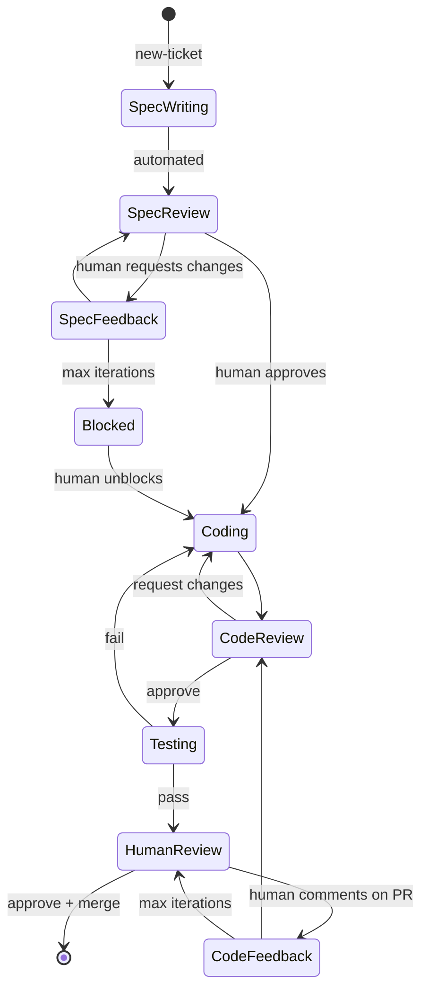
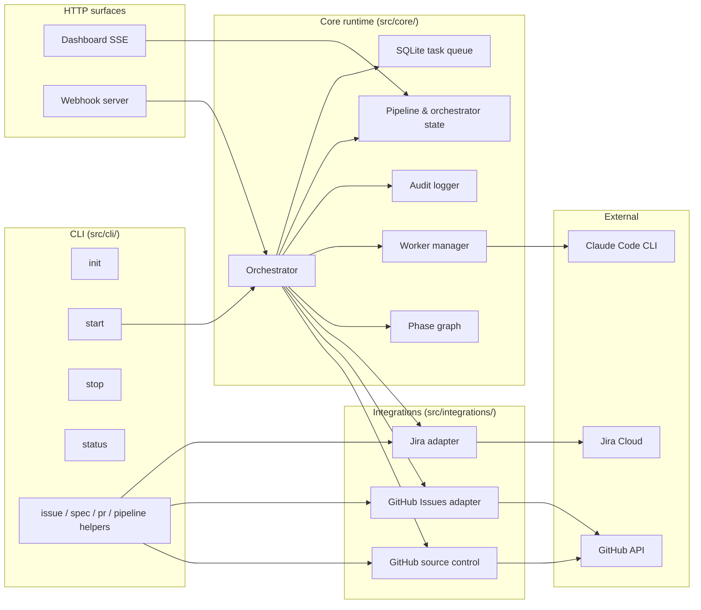

# Red Queen

[](https://github.com/odyth/red-queen/actions/workflows/ci.yml)
[](https://opensource.org/licenses/MIT)
[](#preview-release)

**The Red Queen doesn't think. It commands.**

Deterministic orchestrator for AI coding agents — zero tokens, full SDLC pipeline, human-in-the-loop gates.

## Preview release

> **v0.1.0 is a preview release.** The API surface is stable enough to build
> on, but expect rough edges. Please file bugs at
> [github.com/odyth/red-queen/issues](https://github.com/odyth/red-queen/issues).

## What Is Red Queen?

Red Queen is a state machine that orchestrates AI coding agents through a complete software development lifecycle. It dispatches isolated AI workers to write specs, implement code, review PRs, run tests, and address feedback — all without spending a single AI token on orchestration.

The orchestrator is ~600 lines of deterministic logic. No black box. No AI deciding what to do next. Just a state machine that commands workers and enforces human checkpoints.

## Key Features

- **Zero-token orchestration** — The state machine is pure logic. Cheaper, faster, and fully debuggable compared to AI-driven orchestrators.
- **Isolated skill workers** — Each phase (spec writing, coding, review, testing, feedback) runs a purpose-built prompt in isolation. Focused prompts outperform kitchen-sink mega-agents.
- **Human-in-the-loop gates** — Human review checkpoints are first-class workflow, not an afterthought. You stay in control.
- **Issue tracker integration** — Bidirectional sync with Jira and GitHub Issues. Work flows from your issue tracker through the pipeline and back.
- **Retry with escalation** — Failed phases retry up to 3 times, then escalate to a human. No infinite loops.
- **Webhook + polling** — Optional webhook server for instant response, with polling fallback that works out of the box.

## Pipeline



## Quickstart

Get Red Queen running on your own GitHub repo in ~15 minutes using a
Personal Access Token. This path has no Jira dependency and no App
registration.

### 1. Install

```bash
npm install -g redqueen
# or run each command with `npx redqueen ...`
```

### 2. Generate a GitHub PAT

Go to <https://github.com/settings/personal-access-tokens/new>. Create a
fine-grained token scoped to your target repo with:

- **Repository access**: only the target repo
- **Permissions**: Contents (read/write), Issues (read/write), Pull
  requests (read/write), Workflows (read/write), Metadata (read)

Copy the token.

### 3. Initialize

Inside your git repo:

```bash
redqueen init -y
# Answer prompts for issue tracker type (github-issues) and source control (github).
# `-y` accepts everything else; edit redqueen.yaml afterward if needed.
```

### 4. Add your token

Edit `.env` (created by init, already gitignored):

```
GITHUB_PAT=ghp_xxxxxxxxxxxxxxxxxxxx
```

### 5. Start

```bash
redqueen start
```

Open <http://127.0.0.1:4400> — the dashboard.

### 6. Create a test issue

In your GitHub repo, open a new issue describing a small change. Add the
`rq:phase:spec-writing` label — this is what the polling reconciler
looks for (it iterates automated phases and enqueues work for any issue
carrying the matching `rq:phase:*` label). Red Queen creates the label
automatically on first use if it doesn't exist yet, but you need to add
it to the issue yourself.

The orchestrator polls every 30 seconds; you'll see the label move
through `rq:phase:spec-writing` → `rq:phase:spec-review` →
`rq:phase:coding` etc. as phases complete. Red Queen adds `rq:active`
on its own while it's working — don't add that one manually.

That's the loop. See the [GitHub Issues adapter
README](https://github.com/odyth/red-queen/blob/master/src/integrations/github-issues/README.md)
for full label conventions, webhook setup (which enables the
`new-ticket` on-assign flow), and troubleshooting.

## Full Setup

- **Jira + GitHub source control** — see
  [Jira adapter README](https://github.com/odyth/red-queen/blob/master/src/integrations/jira/README.md)
  and
  [GitHub source control README](https://github.com/odyth/red-queen/blob/master/src/integrations/github/README.md).
- **GitHub Issues + GitHub source control** (easiest) — see the
  [GitHub Issues adapter README](https://github.com/odyth/red-queen/blob/master/src/integrations/github-issues/README.md).
- **Webhooks** — see each adapter's README for setup. Polling works
  out of the box; webhooks are a latency optimization.

## Example Configs

Two complete, copy-pasteable configurations live in
[`examples/`](https://github.com/odyth/red-queen/tree/master/examples):

- [`examples/github-issues/`](https://github.com/odyth/red-queen/tree/master/examples/github-issues) —
  GitHub Issues + GitHub source control with a PAT. The simplest possible setup.
- [`examples/jira-github/`](https://github.com/odyth/red-queen/tree/master/examples/jira-github) —
  Jira issue tracker + GitHub source control with a BYO GitHub App.
  Mirrors the prototype this project was extracted from.

## Architecture



```
src/
├── cli/               # CLI commands (init, start, stop, status, helpers)
├── core/              # State machine, queue, config, orchestrator
├── dashboard/         # Embedded dashboard + SSE events
├── integrations/      # Issue tracker & source control adapters
│   ├── jira/          # Jira adapter
│   ├── github/        # GitHub source control
│   └── github-issues/ # GitHub Issues as an issue tracker
├── skills/            # Default skill templates (user-overridable)
├── templates/         # Scaffolding templates used by `redqueen init`
└── webhook/           # Optional webhook server (shares dashboard port)
```

Red Queen uses an adapter pattern for integrations. All issue trackers implement a common `IssueTracker` interface, making it straightforward to add support for Linear, Shortcut, or any other tracker.

## How Is This Different?

Most AI coding tools use AI to orchestrate AI — spending tokens to decide what to do next. Red Queen takes the opposite approach:

| | Red Queen | AI-Driven Orchestrators |
|---|---|---|
| Orchestration cost | Zero tokens | Tokens on every decision |
| Debuggability | Read the state machine | Hope the LLM explains itself |
| Predictability | Deterministic | Probabilistic |
| Skill isolation | Focused, purpose-built prompts | Shared context, kitchen-sink prompts |
| Human oversight | Built-in gates | Bolt-on afterthought |

## Integrations

| Integration | Status |
|---|---|
| Jira | Supported |
| GitHub Issues | Supported |
| GitHub (source control) | Supported |
| Linear | Planned |

## Contributing

See [CONTRIBUTING.md](https://github.com/odyth/red-queen/blob/master/CONTRIBUTING.md)
for the dev loop, code style, and how to add a new adapter.

## Requirements

- Node.js >= 24
- An AI coding agent CLI (e.g., Claude Code)
- An issue tracker (Jira or GitHub Issues)

## License

MIT — see [LICENSE](LICENSE).

## Links

- **Website:** [redqueen.sh](https://redqueen.sh)
- **Issues:** [GitHub Issues](https://github.com/odyth/red-queen/issues)
- **Changelog:** [CHANGELOG.md](CHANGELOG.md)
