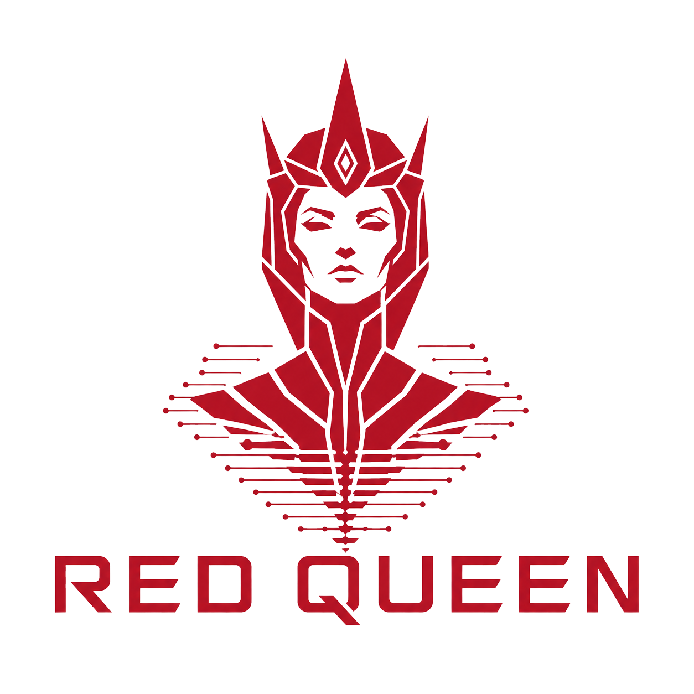
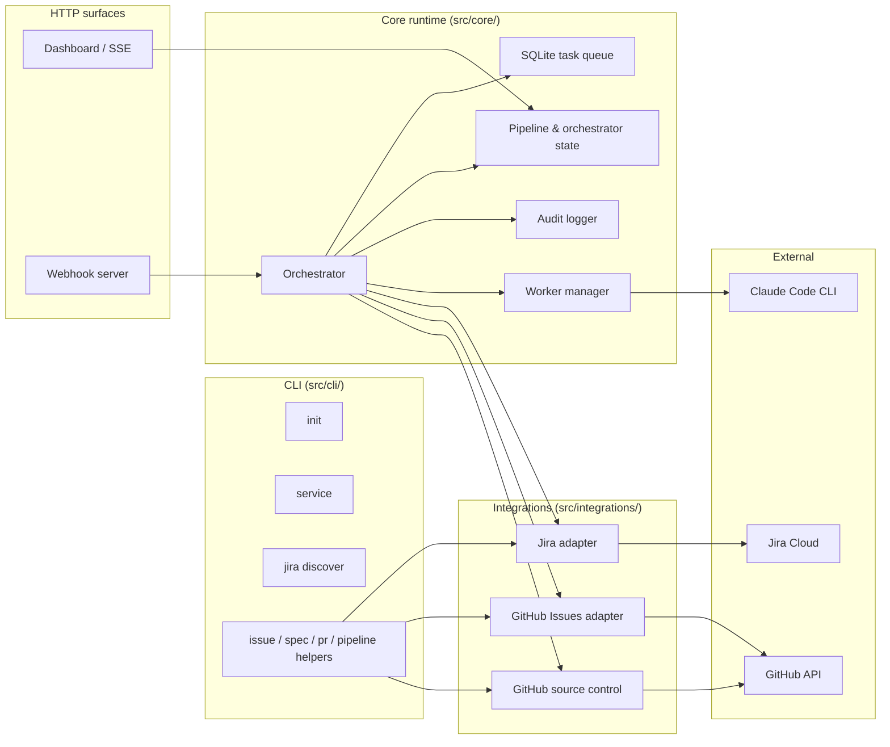

# Red Queen

<p align="center"></p>

> Named for the AI that ran The Hive. Yours runs your SDLC.

[](https://github.com/odyth/red-queen/actions/workflows/ci.yml)
[](https://opensource.org/licenses/MIT)

**The Red Queen doesn't think. It commands.**

Red Queen is a deterministic, zero-token orchestrator that turns Jira or
GitHub tickets into reviewed pull requests via Claude Code. You file a
ticket; Red Queen writes a spec, implements the code, runs automated
review, and hands the final PR back for human approval — all without
spending tokens on orchestration itself.

## TL;DR

You assign a ticket. Red Queen has Claude write a spec. You approve at a
human gate. Claude writes the code and opens a PR. Another Claude
reviews it. Another tests it. You review the final PR and merge. You
can step in at any gate, or remove the gates entirely.

The orchestrator is a state machine, not an LLM. No AI tokens are spent
deciding what to do next. Skills are user-overridable markdown prompts;
phases are dynamic config in `redqueen.yaml`.

## Install

```bash
npm install -g redqueen
```

**Requirements:**

- Node.js >= 24
- [Claude Code CLI](https://docs.anthropic.com/en/docs/claude-code/overview) installed and authenticated (`claude --version` must work in your shell)
- An issue tracker: Jira Cloud or GitHub Issues
- A git repo with a remote on GitHub

## Quickstart (Jira)

This is the primary path — Red Queen was built for teams already running
Jira-driven SDLC.

### 1. Scaffold

In the root of your git repo:

```bash
redqueen init
```

Answer the prompts. Pick `jira` for issue tracker and `github` for
source control. `init` writes `redqueen.yaml`, a gitignored `.env`, a
codebase map, and reference templates under `.redqueen/references/`.

### 2. Fill in secrets

Open `.env` and set:

```
JIRA_TOKEN=...      # Atlassian API token (id.atlassian.com → Security)
GITHUB_PAT=...      # fine-grained PAT scoped to your repo
```

### 3. Discover Jira schema

Custom field IDs and phase option IDs are tenant-specific. Let Red
Queen fetch them:

```bash
redqueen jira discover
```

This queries your Jira project, picks the phase and spec custom fields,
matches each Red Queen phase against Jira option values, and patches
`redqueen.yaml` with the resolved IDs. Unmatched phases stay as
`<CHANGE ME>` — fix them manually. Use `--dry-run` to preview, `--yes`
to skip the confirmation prompt.

### 4. Install the service

```bash
redqueen service install
redqueen service start
```

On macOS this generates a LaunchAgent under `~/Library/LaunchAgents/`;
on Linux, a `--user` systemd unit under `~/.config/systemd/user/`. The
installer auto-detects `claude` on your PATH and writes the absolute
path into `pipeline.claudeBin` so the service's restricted PATH can't
strand it.

### 5. Dashboard

Open <http://127.0.0.1:4400>. Five tabs:

- **Status** — live phase, queue depth, last poll, SSE event stream.
- **Service** — start / stop / restart the daemon, log paths.
- **Config** — edit `redqueen.yaml` in-browser; save triggers a hot
  reload and shows which sections applied vs. require restart.
- **Skills** — list bundled and user-overridden prompts; disable any
  skill via `skills.disabled`.
- **Workflow** — add, remove, reorder phases with live validation;
  refuses to save while tasks are in flight.

### 6. Assign a ticket

In Jira, set the **AI Phase** field on a ticket to `Spec Writing` and
assign it to the AI bot account. The orchestrator polls every 30
seconds (or reacts to a webhook if configured). You'll see it move:
`Spec Writing` → `Spec Review` (human gate) → `Coding` → `Code Review`
→ `Testing` → `Human Review` → merged.

## Alternative: GitHub Issues

If you'd rather drive the pipeline from GitHub Issues, pick
`github-issues` at `redqueen init`. Labels (`rq:phase:spec-writing`,
etc.) take the place of Jira custom fields. See the
[GitHub Issues adapter README](./src/integrations/github-issues/README.md)
for the full label convention and webhook setup.

## Service management

```bash
redqueen service install     # write plist/unit + wrapper, enable, start
redqueen service status      # show install/run state + log paths
redqueen service start       # start (bootstrap if unloaded)
redqueen service stop        # stop + fully unload
redqueen service restart     # stop + start
redqueen service uninstall   # stop, disable, remove plist/unit
```

The wrapper script (`.redqueen/run-redqueen.sh`) sources `.env` before
execing `node redqueen start`, so your plist/unit never contains secret
values. Log paths default to `.redqueen/redqueen.{out,err}.log` under
the project directory.

## Configuration

All runtime config lives in `redqueen.yaml`. `redqueen init` writes a
sensible default; the schema is documented inline in
[`src/core/config.ts`](./src/core/config.ts), and two full reference
configs live under [`examples/`](./examples/) — one GitHub Issues, one
Jira.

`${ENV_VAR}` references in the YAML are interpolated at load time from
`process.env` (and from the adjacent `.env` file). Use `${JIRA_TOKEN}`
and `${GITHUB_PAT}` for secrets — never paste literal values, the
dashboard validator will reject them.

## Verification checklist

After `redqueen service start`:

- `redqueen status` prints `Red Queen — running` with a PID.
- The dashboard at <http://127.0.0.1:4400> loads and the **Service**
  tab shows the state pill as `running`.
- An assigned ticket moves from the entry phase into the first
  automated phase within one poll interval.
- `.redqueen/audit.log` shows phase transitions as they happen.
- `redqueen service stop` followed by `redqueen service start` leaves
  the service running.

## Troubleshooting

| Symptom | Likely cause | Fix |
|---|---|---|
| `command not found: redqueen` | Global install failed or not on PATH | Re-run `npm install -g redqueen`, verify `which redqueen` |
| Service starts but workers fail with `claude: command not found` | `claude` not on the service's runtime PATH | Re-run `redqueen service install` to re-detect, or set `pipeline.claudeBin` explicitly |
| Clicking Dashboard **Stop** leaves no way to restart from the UI | Expected — the dashboard is served by the service it just killed | Run `redqueen service start` from a terminal |
| Jira issues aren't being picked up | Webhook not delivering or `customFields` wrong | Check `.redqueen/audit.log`, run `redqueen jira discover --dry-run`, confirm the Jira webhook is reaching your `publicBaseUrl` |
| `401 Unauthorized` from GitHub | PAT missing a scope | Regenerate fine-grained PAT with Contents / Issues / PRs / Workflows / Metadata |
| Worker stalls mid-phase | Claude Code prompt hit an unexpected state | Check `.redqueen/audit.log`; phase retries up to 3, then escalates to `blocked` |

Per-adapter troubleshooting lives in each adapter's README.

## Architecture



Adapter pattern — all issue trackers implement `IssueTracker`, all
source control implements `SourceControl`. Adding Linear or Bitbucket
is a new adapter, not a core change.

## For AI agents

Working inside this repo? Start with [AGENTS.md](AGENTS.md) — build
commands, code style, interfaces. Installing Red Queen into a user's
project? Hand this to your agent:

> "Install redqueen, run `redqueen init` for jira + github, fill the
> tokens in `.env`, then `redqueen jira discover`, then
> `redqueen service install && redqueen service start`."

LLM crawler index: [llms.txt](llms.txt).

## Links

- [CHANGELOG.md](CHANGELOG.md) — release notes
- [CONTRIBUTING.md](CONTRIBUTING.md) — dev loop, code style, adding adapters
- [LICENSE](LICENSE) — MIT
- [Examples](./examples/) — copy-pasteable reference configs
- [Website](https://redqueen.sh)
- [Issue tracker](https://github.com/odyth/red-queen/issues)
