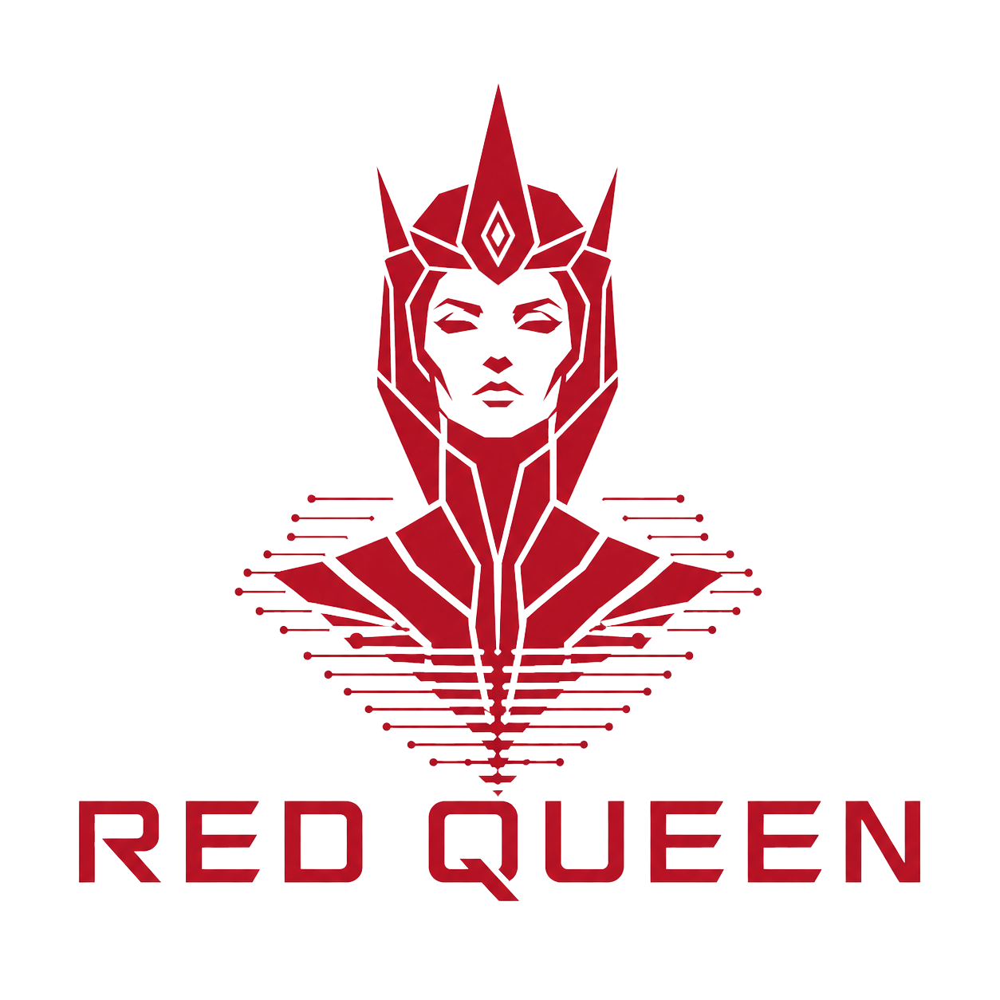
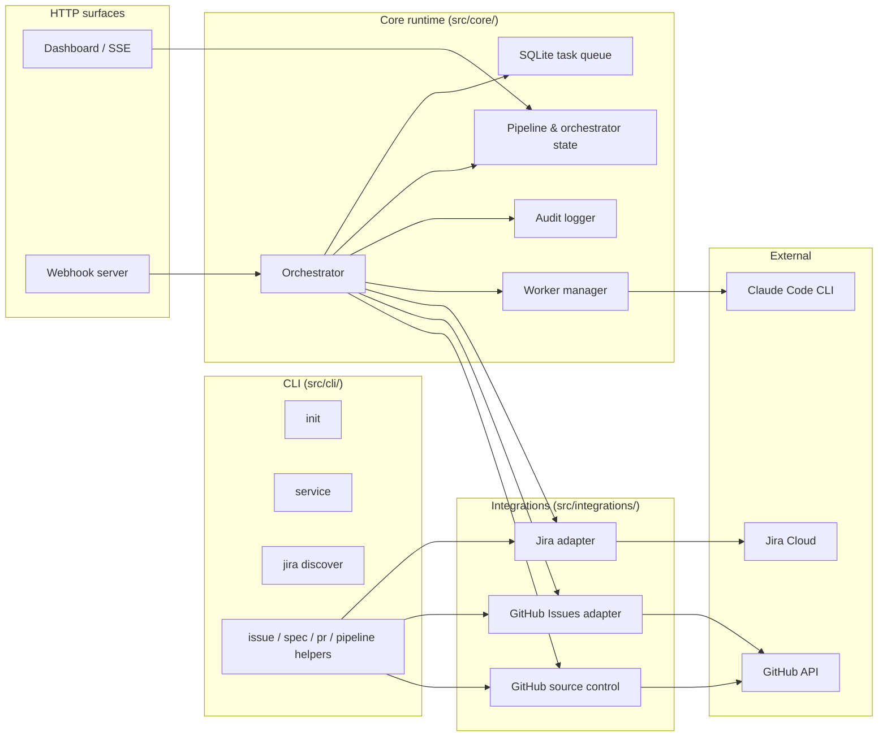

# Red Queen

<p align="center"></p>

> Named for the AI that ran The Hive. Yours runs your SDLC.

[](https://github.com/odyth/red-queen/actions/workflows/ci.yml)
[](https://opensource.org/licenses/MIT)

**Red Queen is to Claude Code what Jenkins is to bash.**

A deterministic state machine that shuttles Jira or GitHub tickets through a
configurable AI coding pipeline — spec, code, review, test, human review —
and drops a merged PR out the end. The orchestrator itself spends zero AI
tokens; it just dispatches Claude Code workers between phases and stops at
the gates you configure.

## TL;DR

You assign a ticket. Claude writes a spec. You approve at the human gate.
Claude writes the code and opens a PR. Another Claude reviews it. Another
tests it. You review the final PR and merge. Step in at any gate, or remove
them entirely.

Phases, skills, and gates are all declared in `redqueen.yaml` — add a
`security-review` phase, override a skill prompt by dropping a file into
`.redqueen/skills/`. The graph is yours to shape.

## Install

```bash
npm install -g redqueen
```

**Requirements:**

- Node.js >= 24
- An AI CLI installed and authenticated — [Claude Code](https://docs.anthropic.com/en/docs/claude-code/overview) (`claude --version` must work in your shell; the default) and/or [OpenAI Codex](https://developers.openai.com/codex/) (`codex --version`, if you set `agent: codex`)
- An issue tracker: Jira Cloud or GitHub Issues
- A git repo with a remote on GitHub

## Quickstart (Jira)

This is the primary path — Red Queen was built for teams already running
Jira-driven SDLC.

### 1. Scaffold

In the root of your git repo:

```bash
redqueen init
```

Answer the prompts. Pick `jira` for issue tracker and `github` for
source control. `init` writes `redqueen.yaml`, a gitignored `.env`, a
codebase map, and reference templates under `.redqueen/references/`.

### 2. Fill in secrets

Open `.env` and set:

```
JIRA_TOKEN=...      # Atlassian API token (id.atlassian.com → Security)
GITHUB_PAT=...      # fine-grained PAT scoped to your repo
```

### 3. Discover Jira schema

Custom field IDs and phase option IDs are tenant-specific. Let Red
Queen fetch them:

```bash
redqueen jira discover
```

This queries your Jira project, picks the phase and spec custom fields,
matches each Red Queen phase against Jira option values, and patches
`redqueen.yaml` with the resolved IDs. Unmatched phases stay as
`<CHANGE ME>` — fix them manually. Use `--dry-run` to preview, `--yes`
to skip the confirmation prompt.

### 4. Install the service

```bash
redqueen service install
redqueen service start
```

On macOS this generates a LaunchAgent under `~/Library/LaunchAgents/`;
on Linux, a `--user` systemd unit under `~/.config/systemd/user/`. The
installer auto-detects `claude` on your PATH and writes the absolute
path into `pipeline.claudeBin` so the service's restricted PATH can't
strand it.

### 5. Dashboard

Open <http://127.0.0.1:4400>. Five tabs:

- **Status** — live phase, queue depth, last poll, SSE event stream,
  and per-issue repo/branch/PR lists.
- **Service** — start / stop / restart the daemon, log paths.
- **Config** — edit `redqueen.yaml` in-browser; save triggers a hot
  reload and shows which sections applied vs. require restart.
- **Skills** — list bundled and user-overridden prompts; disable any
  skill via `skills.disabled`.
- **Workflow** — add, remove, reorder phases with live validation;
  refuses to save while tasks are in flight. Also shows per-issue
  repo/branch/PR lists.

### 6. Assign a ticket

In Jira, set the **AI Phase** field on a ticket to `Spec Writing` and
assign it to the AI bot account. The orchestrator polls every 30
seconds (or reacts to a webhook if configured). You'll see it move:
`Spec Writing` → `Spec Review` (human gate) → `Coding` → `Code Review`
→ `Testing` → `Human Review` → merged.

A few things worth knowing about how the loop behaves:

- **Spec rework** loops back through `Spec Feedback` up to three times
  before escalating to a blocked gate.
- **Code rework** — whether from a failed `Code Review` or `Testing` —
  routes back to `Coding` and pushes to the _same PR_. The coder reads
  the prior phase from its context and either addresses reviewer
  blockers or reproduces the test failure locally before pushing.
- **Worker retry exhaustion** stops automatic retries. Default Coding escalates
  to `Blocked`; if your config declares its own phases, add `escalateTo: blocked`
  to its Coding entry to use that gate. A phase with no failure route stays
  stopped across reconciliation and restarts, posts a failure notice, and hands
  ownership back to a human. After resolving the failure, run
  `redqueen pipeline resume <issueId>` from the project directory to enqueue one
  fresh attempt budget. The ticket must be open and in an automated phase;
  this command cannot bypass a human gate or an unconfirmed tracker phase write.
  Moving a stopped ticket through a human gate and back also permits recovery
  once a webhook or reconciliation observes it at the gate. Without webhooks,
  leave it at the gate for a reconciliation sweep (300 seconds by default).
  An unobserved round trip requires `pipeline resume` or explicit reassignment
  to AI with a delivered assignment webhook. Phase-change webhooks verify moves
  away from an exhausted phase; same-phase redeliveries never renew its budget.
  Passive polling alone never renews its budget.
- **Failed tracker handoffs** are persisted and retried during reconciliation,
  without launching another worker. Phase writes and assignment writes recover
  separately. Failed phase writes back off for five, ten, twenty, forty, then
  sixty minutes between attempts, subject to the reconciliation interval, and
  keep retrying at that cap. After three failures, a single ticket notice asks
  for tracker repairs; failed notice delivery is retried with the next attempt.
  The retry schedule and delivered-notice flag survive restarts.
  Once the phase write is confirmed, a manual move away takes
  precedence, including a return to the source phase. Assignment failures post
  a ticket notice and get at most three attempts, with delays of five and ten
  minutes between attempts (subject to the reconciliation interval). After that,
  human gates remain available for manual review; automated phases stay paused
  until explicit recovery. `pipeline resume` can repair an assignment-only hold,
  and reassignment to AI through a delivered assignment webhook also recovers it.
  Polling-only deployments must use `pipeline resume`. AI ownership is
  checked again before recovered work starts. Resume saves its guarded task
  before assigning AI; if assignment fails, assign the ticket to AI manually
  and the saved task will recheck ownership before running. Queued or deferred
  PR feedback for another phase is preserved and does not block resume; working
  tasks and existing destination tasks still do. Hot reload refuses to remove
  a phase while a handoff to it remains pending.
- **Queued PR feedback** survives phase handoffs, including feedback received
  while Testing finishes and the ticket moves to Human Review. Stale phase tasks
  are still cancelled, and normal dispatch guards apply to the preserved feedback.
- **Setup failures**, including missing binaries, unavailable skills, and prompt
  file write errors, use bounded retries before a human handoff or durable stop.
- **Testing rework** allows three returns to Coding before escalating to Human
  Review. Rework counts are stored per failing phase and survive restarts and
  successful intermediate phases; that phase succeeding or an explicit human
  restart resets its count.
- **Code Review and Testing both comment on the PR every run.** Review
  verdicts and an append-only test history land on the PR so you can
  see what each iteration produced without digging through logs.
- **Skip the spec gate when the spec is ready.** Set
  `pipeline.skipSpecReviewIfReady: true` and the orchestrator will jump
  straight from `Spec Writing` to `Coding` whenever the spec writer
  finishes with zero open questions. Leave it off (default) to always
  human-review the spec.

## Alternative: GitHub Issues

If you'd rather drive the pipeline from GitHub Issues, pick
`github-issues` at `redqueen init`. Labels (`rq:phase:spec-writing`,
etc.) take the place of Jira custom fields. See the
[GitHub Issues adapter README](./src/integrations/github-issues/README.md)
for the full label convention and webhook setup.

## Service management

```bash
redqueen service install     # write plist/unit + wrapper, enable, start
redqueen service status      # show install/run state + log paths
redqueen service start       # start (bootstrap if unloaded)
redqueen service stop        # stop + fully unload
redqueen service restart     # stop + start
redqueen service uninstall   # stop, disable, remove plist/unit
```

The wrapper script (`.redqueen/run-redqueen.sh`) sources `.env` before
execing `node redqueen start`, so your plist/unit never contains secret
values. Log paths default to `.redqueen/redqueen.{out,err}.log` under
the project directory.

## Configuration

All runtime config lives in `redqueen.yaml`. `redqueen init` writes a
sensible default; the schema is documented inline in
[`src/core/config.ts`](./src/core/config.ts), and two full reference
configs live under [`examples/`](./examples/) — one GitHub Issues, one
Jira.

`${ENV_VAR}` references in the YAML are interpolated at load time from
`process.env` (and from the adjacent `.env` file). Use `${JIRA_TOKEN}`
and `${GITHUB_PAT}` for secrets — never paste literal values, the
dashboard validator will reject them.

### Choosing the worker agent

Workers run on Claude Code by default. `pipeline.agent` switches the
default CLI, and any phase can override `agent` / `model` / `effort`
individually — e.g. Claude for planning and review, Codex for coding:

```yaml
pipeline:
  agent: claude-code # or codex; default claude-code
  model:
    opus # optional; names are agent-specific — omit under codex
    # to let ~/.codex/config.toml decide
  effort:
    max # optional; omitted defaults to max
    # provider-specific values are accepted

phases:
  - name: coding
    # ...routing fields...
    agent: codex # per-phase override; wins over pipeline.agent
    model: gpt-5.6-sol
    effort: ultra
```

Resolution is phase-over-pipeline per field, with one guard: the
pipeline `model` never carries across an agent switch (model names are
agent-specific). A phase that overrides only `agent` runs that CLI's
default model. Effort is an opaque, CLI-specific value: Red Queen defaults
it to `max` and forwards configured values without enumerating provider modes.
The legacy Claude `minimal` value remains an alias for `low`; other unsupported
values are left to the downstream CLI, with successful-process warnings written
to the audit log. Codex runs report token usage but no dollar cost — add a
`pipeline.cost.pricing` entry keyed by the model name to price them. Effort
inherits across agent switches, so mixed pipelines should override it per phase
when their CLIs or models support different modes.

### Stacked branches

Issues linked as blockers (Jira "blocks" links, GitHub issue
dependencies) build on their blockers' branches: the dependent's
worktree merges ancestor branches in topo order, and its PR targets the
nearest still-gated ancestor branch so nothing merges past human
review. When a blocker's PR merges, dependent PRs are retargeted onto
the merged base and the merged code is folded into their branches.

Retargeting runs from PR-merged webhooks and from merge reconciliation at
startup and on each poll tick. Poll-only installs
(`pipeline.webhooks.enabled: false`) therefore handle merged PRs too.
If GitHub has already retargeted a dependent after deleting its ancestor's
head branch, Red Queen still refreshes the dependent's branch.

### Multi-repo workspaces

One instance can drive several repos. Install Red Queen in a **workspace
root** — a folder containing your clones — and declare them under
`project.repos[]`. For example, use these project and source-control
sections alongside your existing issue-tracker and pipeline configuration:

```yaml
project:
  directory: .
  repos:
    - name: api # ^[a-z0-9][a-z0-9-]*$ — used in paths and --repo flags
      path: ./Api # relative to project.directory, or absolute
      owner: acme
      repo: Api
      baseBranch: origin/main # optional; defaults to pipeline.baseBranch
      buildCommand: dotnet build
      testCommand: dotnet test
      modules: # optional; module paths are relative to this repo
        - name: portal
          paths: ["src/Portal/**"]
          buildCommand: dotnet build src/Portal
          testCommandTargeted: dotnet test src/Portal.Tests
    - name: email-templates
      path: ./EmailTemplates
      owner: acme
      repo: EmailTemplates
      buildCommand: npm run build
      testCommand: npm test

sourceControl:
  type: github
  config:
    auth:
      type: pat
      token: ${GITHUB_PAT}
    webhookSecret: ${GITHUB_WEBHOOK_SECRET} # omit when webhooks are disabled
```

Declaring `project.repos` enables workspace mode, even with only one entry.
Each path must point to a git work tree root, and repo names and upstream
`owner/repo` identities must be unique. Top-level `project.buildCommand`,
`project.testCommand`, `project.modules`, `sourceControl.config.owner`, and
`sourceControl.config.repo` are rejected in this mode: those settings belong
in each repo entry. Source-control auth and its webhook secret stay shared.

GitHub App auth requires every repo to have the same owner, compared
case-insensitively. A paired `github-issues` tracker must share that owner
too, including when source control inherits the tracker's App auth. The
tracker keeps its own `owner/repo`; its repo need not appear in `repos[]`.
PAT auth permits mixed owners if the shared token can access every repo.

Getting there:

- **Fresh workspace:** run `redqueen init` in the parent folder of your
  clones, outside a git work tree root. It discovers immediate git children,
  derives their GitHub `owner/repo` from `origin`, and prompts for which to
  include. `redqueen init --yes` includes all discovered repos with defaults.
  Running `init` at a git root keeps the legacy single-repo setup.
- **Add a repo:** from the directory containing `redqueen.yaml`, run
  `redqueen init --add-repo ./EmailTemplates` (substitute your clone's path).
  This updates the config and workspace map while preserving existing map
  notes. Restart the orchestrator to load repo configuration changes.
  `redqueen init --map-only` regenerates the map while preserving its
  editable notes.
- **Move an existing single-repo install:** run `redqueen migrate --dry-run`
  at its git root to validate and inspect the move, then `redqueen migrate`
  to apply it. Migration moves the config, `.env`, database, and other
  `.redqueen` state up one directory, lifts the existing repo into
  `repos[0]`, and moves registered issue/spec worktrees through Git into the
  workspace layout. Your clone stays in place. Run subsequent setup commands
  from the parent folder; add sibling clones with `init --add-repo`.
- **Convert in place:** on a stopped legacy install,
  `redqueen init --add-repo ../EmailTemplates` lifts the current repo to
  `path: .` without moving files. It requires `project.directory` to resolve
  to the git root containing the YAML. It refuses a running orchestrator or
  service, existing legacy worktree data, or recorded worktree paths; use
  `redqueen migrate` for installations with in-flight worktrees.

Migration requires Git 2.17 or newer. Stop the orchestrator with
`redqueen stop`, or its managed service with `redqueen service stop`,
**before either a dry run or a real migration**. Run at the git root
containing `redqueen.yaml`, with `project.directory` resolving there. The
parent must contain no `redqueen.yaml`, `.redqueen`, or `.env`; migration
refuses destination collisions. `--dry-run` changes no files or services,
and `redqueen migrate --yes` skips only the confirmation prompt.

Registered worktrees retain their Git registration and local changes.
Nested, locked, missing, or submodule-containing worktrees require repair
before migration. The preview lists stale temporary refresh worktrees for
removal. Unregistered data under the old worktree directory is reported and
left in place. The codebase map is converted while preserving its notes.

Migration preserves configured file references, including App private-key
paths. If an environment-based path into moved state cannot keep the same
meaning, it stops with the affected field and relative-literal guidance;
it does not rewrite your external environment. It also refuses symlinks
whose targets would change after the move. Relative links within jointly
moved state and absolute links to external data can remain valid.

An installed service with `service.enabled: true` keeps its service name
and is reinstalled **last**, after state and config are ready; installation
starts it. An installed service with `service.enabled: false` is uninstalled
and stays stopped.

For each ticket, the prompt-writer reads the workspace map and each
candidate repo's `CLAUDE.md` and `AGENTS.md`, explores a throwaway worktree
for every configured repo, then records scope. For an existing pipeline
ticket touching both repos above, with no unanswered spec questions:

```bash
redqueen spec meta PROJ-123 --open-questions 0 --repos api,email-templates
```

`--repos` is required in workspace mode, including one-repo workspaces.
It accepts a nonempty comma-separated list of configured names and saves
scope together with the open-question count. Downstream skills use that
explicit scope; they do not infer repos or select the first one when scope
is missing. Every `redqueen pr` helper and `redqueen pipeline update` call
also requires `--repo`, even in a one-repo workspace, and `pr create` and
`pipeline update` refuse a repo outside the ticket's scope. For example, read
PR #42 from the `api` repo with:

```bash
redqueen pr diff 42 --repo api
```

The coder creates one branch and PR per in-scope repo; reviews and tests run
per repo. Worktrees live at `.redqueen/worktrees/<issue>/<repo>` and spec
exploration uses `.redqueen/worktrees/spec-<issue>/<repo>`. Skills run git
inside the owning clone or worktree. For stacked issues,
`redqueen stack setup PROJ-123` prepares unfinished in-scope repos; adding
`--spec` prepares exploration worktrees across all configured repos.

The ticket completes only when **every in-scope repo has merged in the
current cycle**. A scoped repo that has not opened a PR still blocks
completion. You choose the merge order across repos. After a partial merge,
rework and testing skip completed repos and do not recreate their PRs or
cleaned worktrees.
Custom skills should use `repos[]` and its `inScope` and `mergeCompleted`
fields; a historical `terminalPrNumber` alone does not prove completion in
a reopened cycle. See the [skill context contract](./src/skills/README.md).

Workspaces run their own prompts. A phase that names `coder` dispatches
`coder-workspace`, so override `.redqueen/skills/coder-workspace/SKILL.md`,
not `coder`. An override of `coder` is a single-repo prompt and does not run
in a workspace; `redqueen migrate` lists the ones you need to port. A custom
skill with no `-workspace` variant runs in both modes.

A repo dropped from scope by a later spec revision keeps its PR for a human
to close. `redqueen status` and the dashboard's **Status** and **Workflow**
tabs show per-issue repo, branch, PR, and scope lists and label these retained
PRs `orphaned`. Orphaned PRs do not count toward ticket completion. The
dashboard header identifies the workspace root; repo configuration remains
in the Config tab's YAML editor.

If webhooks are enabled, add a source-control webhook on every configured
repo, or one org-level webhook covering them, using the same URL and shared
secret. See [GitHub webhook setup](./src/integrations/github/README.md#webhooks-per-repo).
Legacy installs without `repos[]` keep their single-repo configuration and
skill behavior.

## Verification checklist

After `redqueen service start`:

- `redqueen status` prints `Red Queen — running` with a PID.
- The dashboard at <http://127.0.0.1:4400> loads and the **Service**
  tab shows the state pill as `running`.
- An assigned ticket moves from the entry phase into the first
  automated phase within one poll interval.
- `.redqueen/audit.log` shows phase transitions as they happen.
- `redqueen service stop` followed by `redqueen service start` leaves
  the service running.

## Troubleshooting

| Symptom                                                          | Likely cause                                                     | Fix                                                                                                                            |
| ---------------------------------------------------------------- | ---------------------------------------------------------------- | ------------------------------------------------------------------------------------------------------------------------------ |
| `command not found: redqueen`                                    | Global install failed or not on PATH                             | Re-run `npm install -g redqueen`, verify `which redqueen`                                                                      |
| Service starts but workers fail with `claude: command not found` | `claude` not on the service's runtime PATH                       | Re-run `redqueen service install` to re-detect, or set `pipeline.claudeBin` explicitly                                         |
| Workers fail with `codex binary not found`                       | `codex` not on the (service's) runtime PATH                      | Set `pipeline.codexBin` to the absolute path (`which codex`) — service install only auto-detects `claude`                      |
| Clicking Dashboard **Stop** leaves no way to restart from the UI | Expected — the dashboard is served by the service it just killed | Run `redqueen service start` from a terminal                                                                                   |
| Jira issues aren't being picked up                               | Webhook not delivering or `customFields` wrong                   | Check `.redqueen/audit.log`, run `redqueen jira discover --dry-run`, confirm the Jira webhook is reaching your `publicBaseUrl` |
| `401 Unauthorized` from GitHub                                   | PAT missing a scope                                              | Regenerate fine-grained PAT with Contents / Issues / PRs / Workflows / Metadata                                                |
| Worker stalls mid-phase                                          | Claude Code prompt hit an unexpected state                       | Check `.redqueen/audit.log`; phase retries up to 3, then escalates to `blocked`                                                |

Per-adapter troubleshooting lives in each adapter's README.

## Architecture


```mermaid
flowchart LR
  subgraph cli["CLI (src/cli/)"]
    init[init]
    service[service]
    jira[jira discover]
    helpers["issue / spec / pr / pipeline helpers"]
  end

  subgraph core["Core runtime (src/core/)"]
    orchestrator[Orchestrator]
    queue[SQLite task queue]
    stateStore[Pipeline & orchestrator state]
    audit[Audit logger]
    worker[Worker manager]
  end

  subgraph integrations["Integrations (src/integrations/)"]
    jiraAdapter[Jira adapter]
    ghIssues[GitHub Issues adapter]
    ghSC[GitHub source control]
  end

  subgraph edges["HTTP surfaces"]
    dashboard[Dashboard / SSE]
    webhook[Webhook server]
  end

  subgraph ext["External"]
    claude[Claude Code CLI]
    jiraApi[Jira Cloud]
    ghApi[GitHub API]
  end

  orchestrator --> queue
  orchestrator --> stateStore
  orchestrator --> audit
  orchestrator --> worker
  orchestrator --> jiraAdapter
  orchestrator --> ghIssues
  orchestrator --> ghSC
  worker --> claude
  jiraAdapter --> jiraApi
  ghIssues --> ghApi
  ghSC --> ghApi
  dashboard --> stateStore
  webhook --> orchestrator
  helpers --> jiraAdapter
  helpers --> ghIssues
  helpers --> ghSC
```

Adapter pattern — all issue trackers implement `IssueTracker`, all
source control implements `SourceControl`. Adding Linear or Bitbucket
is a new adapter, not a core change.

## For AI agents

Working inside this repo? Start with [AGENTS.md](AGENTS.md) — build
commands, code style, interfaces. Installing Red Queen into a user's
project? Hand this to your agent:

> "Install redqueen, run `redqueen init` for jira + github, fill the
> tokens in `.env`, then `redqueen jira discover`, then
> `redqueen service install && redqueen service start`."

LLM crawler index: [llms.txt](llms.txt).

## Links

- [CHANGELOG.md](CHANGELOG.md) — release notes
- [CONTRIBUTING.md](CONTRIBUTING.md) — dev loop, code style, adding adapters
- [LICENSE](LICENSE) — MIT
- [Examples](./examples/) — copy-pasteable reference configs
- [Website](https://redqueen.sh)
- [Issue tracker](https://github.com/odyth/red-queen/issues)
